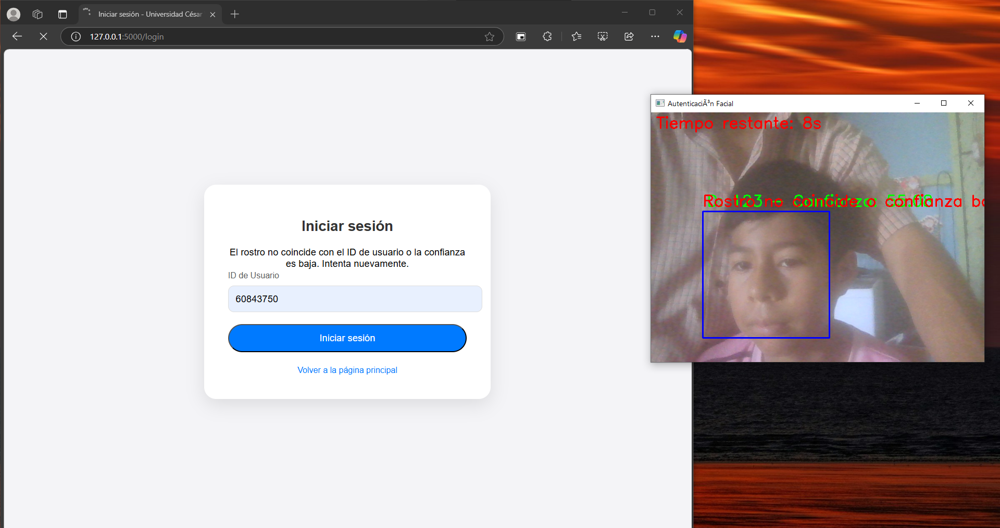

# Sistema de Autenticación Facial

Este proyecto es un **sistema de autenticación basado en reconocimiento facial** utilizando OpenCV y Flask. Permite registrar usuarios mediante la captura de imágenes de sus rostros, entrenar un modelo de reconocimiento facial y autenticar a los usuarios a través de su rostro en tiempo real. Además, el proceso de autenticación incluye una cuenta regresiva de 20 segundos para mejorar la experiencia del usuario.

---

## Funcionalidades

- **Registro de usuario**: Captura de múltiples imágenes del rostro de un usuario para crear su perfil en el sistema.
- **Entrenamiento del modelo**: Utiliza las imágenes capturadas para entrenar un modelo de reconocimiento facial **LBPH (Local Binary Pattern Histogram)**.


- **Autenticación**: Verificación de identidad en tiempo real mediante el reconocimiento facial. Si el rostro del usuario coincide con el registro y la confianza es suficiente, el acceso es concedido.
- **Interfaz web**: Usando **Flask**, proporciona una interfaz web sencilla donde los usuarios pueden registrarse e iniciar sesión.

---

## Tecnologías Utilizadas

- **Python 3.x**: Lenguaje de programación utilizado para el desarrollo del sistema.
- **OpenCV**: Librería para el procesamiento de imágenes y el reconocimiento facial.
- **Flask**: Framework web para crear la aplicación y gestionar las rutas.
- **LBPH (Local Binary Pattern Histogram)**: Algoritmo de OpenCV para la creación del modelo de reconocimiento facial.
- **HTML/CSS**: Para la creación de las páginas web de la interfaz de usuario.

---

## Requisitos

Antes de ejecutar el proyecto, asegúrate de tener instalados los siguientes paquetes en tu entorno:

```bash
pip install opencv-python opencv-contrib-python flask numpy
```

---

## Uso
- **Registrar un usuario:**: Dirígete a la página de registro e ingresa un ID de usuario para comenzar a capturar las imágenes de su rostro.
<div align="center">

  <p><em>Imagen de la página principal donde puedes acceder al registro.</em></p>
</div>

<div align="center">

  <p><em>Imagen de la página principal donde puedes acceder al registro.</em></p>
</div>

- **Entrenar el modelo:**: El sistema entrenará automáticamente el modelo con las imágenes capturadas.
<div align="center">

  <p><em>Imagen de la página principal donde puedes acceder al registro.</em></p>
</div>

- **Autenticación:**: Ve a la página de login e ingresa el ID de usuario. El sistema intentará autenticarte mediante el reconocimiento de tu rostro en tiempo real.
<div align="center">

  <p><em>Imagen de la página principal donde puedes acceder al registro.</em></p>
</div>

<div align="center">

  <p><em>Imagen de la página principal donde puedes acceder al registro.</em></p>
</div>
